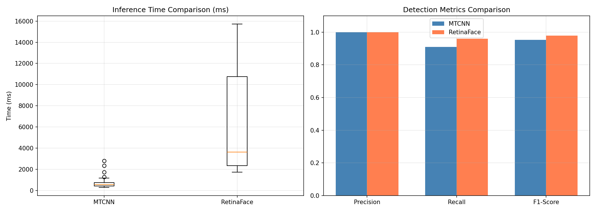
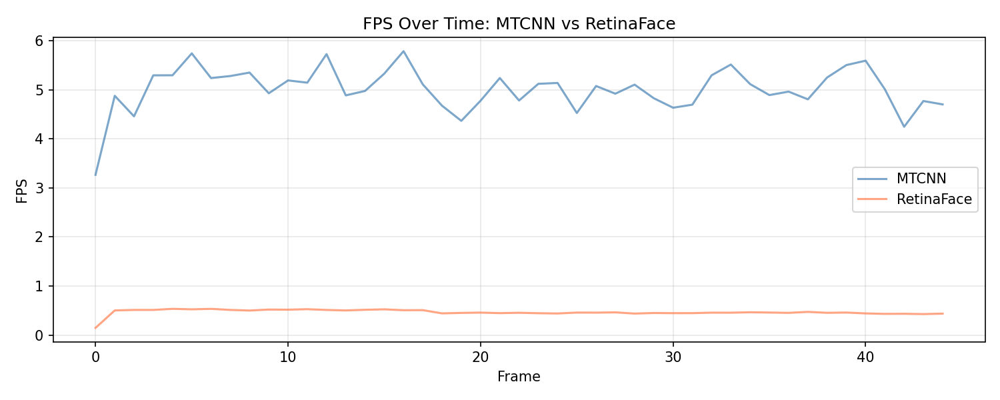

# 🎯 Face Detection & Recognition System
### A Hybrid Deep Learning Approach: ResNet50 + Vision Transformer with ArcFace Loss


---

## 📌 Overview

A two-phase computer vision project that first benchmarks state-of-the-art face **detection** models, then builds a novel **hybrid recognition architecture** combining CNN and Transformer backbones with metric learning.

---

## 🗂️ Project Structure

```
face-recognition/
│
├── 📁 Phase I — Face Detection
│   ├── mtcnn_detector.py         # Real-time MTCNN detection
│   ├── retinaface_detector.py    # Real-time RetinaFace detection
│   ├── compare.py                # Side-by-side FPS comparison
│   └── evaluate.py               # Benchmark on WIDER FACE dataset
│
├── 📁 Phase II — Face Recognition
│   ├── model.py                  # Hybrid ResNet50 + ViT architecture
│   ├── dataset.py                # LFW / VGGFace2 data loaders
│   ├── train.py                  # Training with ArcFace loss
│   ├── evaluate.py               # LFW / CFP-FP / AgeDB-30 evaluation
│   ├── baselines.py              # FaceNet baseline comparison
│   ├── explainability.py         # Grad-CAM + ViT attention maps
│   └── realtime_recognition.py  # Live webcam recognition pipeline
│
└── setup_phase2.py               # One-click environment setup
```

---

## 🔬 Phase I — Face Detection

Comparative evaluation of **MTCNN** vs **RetinaFace** on the WIDER FACE validation dataset, tested under real-world conditions via webcam.

### Results

| Model | Precision | Recall | F1-Score | Avg FPS | Inference Time |
|---|---|---|---|---|---|
| MTCNN | 1.00 | 0.90 | 0.95 | ~5.0 | ~200ms |
| RetinaFace | 1.00 | 0.95 | **0.97** | ~0.5 | ~2000ms |

### Key Findings
- **RetinaFace** achieves higher recall and F1, making it better for accuracy-critical applications
- **MTCNN** is ~10× faster, better suited for real-time systems
- RetinaFace detects more faces in crowded/occluded scenes

### Demo
<p align="center">
  
  <br><em>Detection metrics comparison</em>
</p>
<p align="center">
  
  <br><em>Real-time FPS: MTCNN vs RetinaFace</em>
</p>

---

## 🧠 Phase II — Hybrid Face Recognition (In Progress)

A novel hybrid architecture combining **ResNet50** (CNN) and **ViT-B/16** (Vision Transformer) with **ArcFace** metric learning loss for robust face recognition.

### Architecture

```
Input Face (112×112)
        │
   ┌────┴────┐
   ▼         ▼
ResNet50   ViT-B/16
(2048-d)   (768-d)
   └────┬────┘
        ▼
  Feature Fusion
  ┌─────────────────────────┐
  │  1. Concatenation       │
  │  2. Weighted Blend      │
  │  3. Cross-Attention     │
  └─────────────────────────┘
        ▼
  512-d L2 Embedding
        ▼
   ArcFace Loss
```

### Why Hybrid?
- **ResNet50** excels at local texture features (skin, edges)
- **ViT-B/16** captures global spatial relationships (face structure)
- **Fusion** combines both for more robust embeddings

### Datasets
| Purpose | Dataset | Size |
|---|---|---|
| Training | LFW subset / VGGFace2 | 13,233+ images |
| Evaluation | LFW | 6,000 pairs |
| Evaluation | CFP-FP | Frontal-Profile pairs |
| Evaluation | AgeDB-30 | Age-gap pairs |

### Baselines Compared
- ArcFace (ResNet50 only)
- FaceNet (InceptionResNet-V1)
- ViT-B/16 only
- **Hybrid (concat / weighted / attention)** ← proposed

---

## ⚙️ Setup

```bash
# Clone the repo
git clone https://github.com/adi-with-tea/Face-recognition
cd Face-recognition

# Create virtual environment
python -m venv face_env
face_env\Scripts\activate      # Windows
# source face_env/bin/activate  # Linux/Mac

# Install dependencies
python setup_phase2.py
```

### Dependencies
```
torch, torchvision, timm, opencv-python
mtcnn, retinaface, facenet-pytorch
scikit-learn, matplotlib, numpy, Pillow
```

---

## 🚀 Usage

### Phase I — Run detection
```bash
python mtcnn_detector.py          # MTCNN webcam demo
python retinaface_detector.py     # RetinaFace webcam demo
python compare.py                 # Side-by-side comparison
python evaluate.py                # Benchmark on WIDER FACE
```

### Phase II — Train & Evaluate
```bash
# Train hybrid model (3 fusion variants)
python train.py --data data/train --model hybrid_concat --epochs 10
python train.py --data data/train --model hybrid_weighted --epochs 10
python train.py --data data/train --model hybrid_attention --epochs 10

# Evaluate on LFW
python evaluate.py --compare --lfw_dir data/lfw --lfw_pairs data/matchpairsDevTest.csv

# Live face recognition
python realtime_recognition.py --checkpoint checkpoints/hybrid_concat_best.pth

# Explainability (Grad-CAM)
python explainability.py --image path/to/face.jpg --checkpoint checkpoints/hybrid_concat_best.pth
```

---

## 🛠️ Tech Stack

| Category | Tools |
|---|---|
| Deep Learning | PyTorch, timm |
| Face Detection | MTCNN, RetinaFace |
| Face Recognition | ArcFace, FaceNet |
| Computer Vision | OpenCV, Pillow |
| Evaluation | scikit-learn, matplotlib |
| Language | Python 3.10 |

---

## 📊 Training Progress

Loss decreases consistently across epochs demonstrating effective learning:

| Epoch | Loss |
|---|---|
| 1 | 37.86 |
| 2 | 32.39 |
| 3 | 26.81 |

---

## 🔮 Roadmap

- [x] Phase I: MTCNN vs RetinaFace detection comparison
- [x] Phase I: WIDER FACE evaluation
- [x] Phase II: Hybrid architecture implementation
- [x] Phase II: ArcFace loss integration
- [x] Phase II: Training pipeline
- [ ] Phase II: Full LFW/CFP-FP/AgeDB-30 evaluation
- [ ] Phase II: Explainability visualizations
- [ ] Phase II: Real-time recognition demo

---

## 👤 Author

**Aditya** — Computer Vision Internship Project  
Built as part of a research internship exploring hybrid CNN-Transformer architectures for face recognition.
